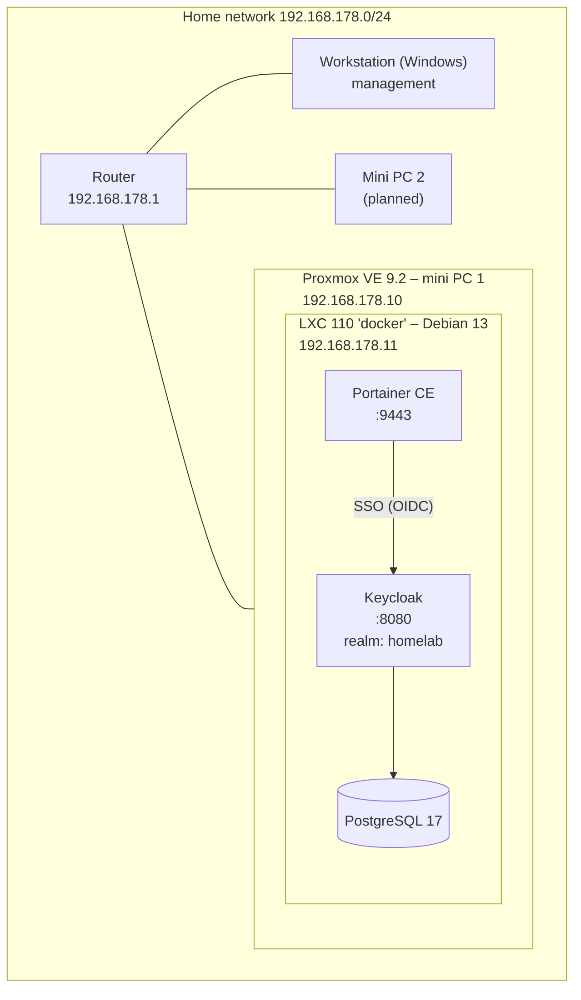

# Homelab – IAM & Platform Engineering

This is my personal lab, where I am building an identity platform based on open standards and modern platform technology. The goal: hands-on experience with **Keycloak, federation (OIDC, OAuth2, SAML), PKI, Docker and Kubernetes**, alongside my preparation for **SC-300 (Microsoft Identity and Access Administrator)**.

Everything I build is documented here: the choices I make, what went wrong and how I fixed it.

---

## Highlights

- 🔐 **Own identity provider:** Keycloak with PostgreSQL, a dedicated realm and mandatory MFA (TOTP)
- 🔁 **Single sign-on via OIDC:** Portainer delegates authentication to Keycloak using the authorization code flow
- 🛡️ **Security by design:** separate admin and user realms, break-glass admin account, no secrets in Git
- 📝 **Documented end to end:** design decisions, problems and lessons learned per chapter

---

## Architecture

| Component | Details |
|---|---|
| **Hypervisor** | Proxmox VE 9.2 (Debian 13 "trixie"), no-subscription repository |
| **Storage** | 512 GB SSD, ext4 with LVM-thin (thin provisioning, discard enabled) |
| **Docker host** | Unprivileged LXC with `nesting` and `keyctl`, Docker Engine |
| **Container management** | Portainer CE, sign-in via Keycloak (OIDC) |
| **Identity provider** | Keycloak with PostgreSQL; realm `master` for administration only, realm `homelab` for users and applications |

---

## Status

| Component | Status |
|---|---|
| Install and update Proxmox VE | ✅ Done |
| Docker LXC with Portainer | ✅ Done |
| Keycloak + PostgreSQL (dev mode) | ✅ Running |
| Configure Keycloak: permanent admin, `homelab` realm, MFA (OTP) | ✅ Done |
| SSO via OIDC: Portainer | ✅ Done |
| SSO via OIDC with role mapping (Grafana) and SAML | 📋 Planned |
| Backups (Proxmox backup jobs, later Proxmox Backup Server) | 📋 Planned |
| Reverse proxy + own CA / TLS certificates | 📋 Planned |
| Keycloak in production mode behind the proxy (HTTPS) | 📋 Planned |
| Federation Keycloak ↔ Microsoft Entra ID | 📋 Planned |
| k3s (Kubernetes) + Helm, Keycloak via the Keycloak Operator | 📋 Planned |
| Keycloak configuration as code + CI/CD (GitHub Actions) | 📋 Planned |
| mTLS and certificate-based authentication | 📋 Planned |
| Custom Keycloak extension (SPI) in Java | 📋 Planned |
| Windows Server (AD DS) + Entra Connect – hybrid identity | 📋 Planned |

---

## Design decisions

- **Docker for core services, Kubernetes for the platform.** DNS, reverse proxy, CA and monitoring run outside the cluster: if the cluster fails, I still need to be able to reach and repair it.
- **Docker in an LXC instead of a VM.** More efficient with RAM and disk. A VM offers better isolation; for a lab, efficiency weighs more heavily here.
- **PostgreSQL instead of Keycloak's built-in H2 database.** More realistic, and configuration survives updates.
- **No users in the `master` realm.** `master` is only for administering Keycloak itself; users and applications live in a separate realm.
- **Bootstrap admin replaced by a permanent admin account.** The temporary account from the deployment configuration is removed once the permanent one is verified.
- **MFA enforced centrally in Keycloak.** Every application connected via SSO inherits MFA without configuring it itself.
- **Exact redirect URIs instead of wildcards.** Keycloak only sends authorization codes to precisely registered addresses.
- **Break-glass access.** Applications keep a local admin account, so a broken SSO integration can never lock me out.
- **No secrets in Git.** Passwords and client secrets are stored in environment variables or in the application itself; the repo only contains `.env.example`.
- **Nothing exposed directly to the internet.** Remote access later only via VPN or a zero-trust tunnel with authentication.

---

## Documentation

| Document | Contents |
|---|---|
| [01 – Proxmox and Docker](docs/01-proxmox-docker.md) | Installation, decisions, problems and solutions |
| [02 – Keycloak setup](docs/02-keycloak-setup.md) | Permanent admin, `homelab` realm, user and mandatory MFA |
| [03 – SSO: Portainer via OIDC](docs/03-sso-portainer-oidc.md) | Authorization code flow, client setup, lessons learned |

## Configuration

| Folder | Contents |
|---|---|
| [`docker/keycloak`](docker/keycloak) | Docker Compose for Keycloak + PostgreSQL |

---

## Lessons learned (so far)

1. **Double-check network settings.** One wrong digit (`179` instead of `178`) and the server ends up in a different subnet than the router.
2. **Keep an eye on disk space.** A full disk while pulling an image produced a corrupted Keycloak image; the error (`kc.sh: no such file or directory`) did not point directly to the cause.
3. **Read the logs.** Almost every problem was solved within minutes once I looked at `ip a`, `docker logs` or `df -h`.
4. **Order matters in access changes.** Create and verify a new admin account before removing the old one.
5. **Authentication and authorisation are separate steps.** SSO proves who you are; what you may do is a deliberate, separate decision.

Details per topic are in the [documentation](#documentation).
