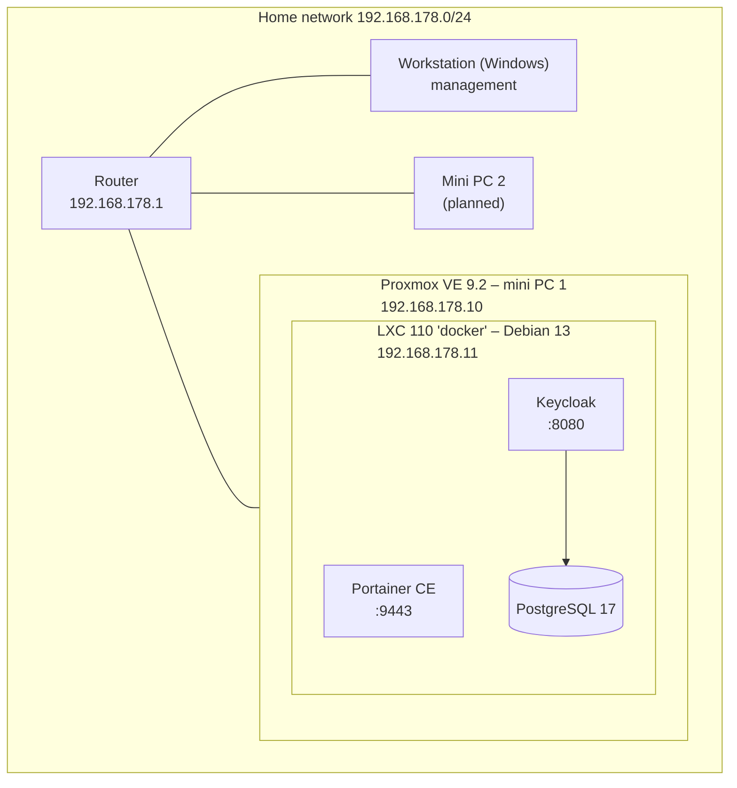

# Homelab – IAM & Platform Engineering

This is my personal lab, where I am building an identity platform based on open standards and modern platform technology. The goal: hands-on experience with **Keycloak, federation (OIDC, OAuth2, SAML), PKI, Docker and Kubernetes**, alongside my preparation for **SC-300 (Microsoft Identity and Access Administrator)**.

Everything I build is documented here: the choices I make, what went wrong and how I fixed it.

---

## Architecture

| Component | Details |
|---|---|
| **Hypervisor** | Proxmox VE 9.2 (Debian 13 "trixie"), no-subscription repository |
| **Storage** | 512 GB SSD, ext4 with LVM-thin (thin provisioning, discard enabled) |
| **Docker host** | Unprivileged LXC with `nesting` and `keyctl`, Docker Engine |
| **Container management** | Portainer CE |
| **Identity provider** | Keycloak with PostgreSQL as its database |

> Hardware: mini PC 1 – . Mini PC 2 – .

---

## Status

| Component | Status |
|---|---|
| Install and update Proxmox VE | ✅ Done |
| Docker LXC with Portainer | ✅ Done |
| Keycloak + PostgreSQL (dev mode) | ✅ Running |
| Configure Keycloak: permanent admin, `homelab` realm, MFA (OTP) | 🔄 In progress |
| Reverse proxy + own CA / TLS certificates | 📋 Planned |
| Keycloak in production mode behind the proxy (HTTPS) | 📋 Planned |
| SSO integrations via OIDC and SAML (Portainer, Grafana) | 📋 Planned |
| Federation Keycloak ↔ Microsoft Entra ID | 📋 Planned |
| Keycloak configuration as code + CI/CD (GitHub Actions) | 📋 Planned |
| Custom Keycloak extension (SPI) in Java | 📋 Planned |
| k3s (Kubernetes) + Helm, Keycloak via the Keycloak Operator | 📋 Planned |
| mTLS and certificate-based authentication | 📋 Planned |
| Windows Server (AD DS) + Entra Connect – hybrid identity | 📋 Planned |
| Backups (Proxmox Backup Server) | 📋 Planned |

---

## Design decisions

- **Docker for core services, Kubernetes for the platform.** DNS, reverse proxy, CA and monitoring run outside the cluster: if the cluster fails, I still need to be able to reach and repair it.
- **Docker in an LXC instead of a VM.** More efficient with RAM and disk. A VM offers better isolation; for a lab, efficiency weighs more heavily here.
- **PostgreSQL instead of Keycloak's built-in H2 database.** More realistic, and configuration survives updates.
- **No users in the `master` realm.** `master` is only for administering Keycloak itself; users and applications live in a separate realm.
- **No secrets in Git.** Passwords are stored in environment variables (`.env`, excluded via `.gitignore`); the repo only contains `.env.example`.
- **Nothing exposed directly to the internet.** Remote access later only via VPN or a zero-trust tunnel with authentication.

---

## Documentation

| Document | Contents |
|---|---|
| [01 – Proxmox and Docker](docs/01-proxmox-docker.md) | Installation, decisions, problems and solutions |

## Configuration

| Folder | Contents |
|---|---|
| [`docker/keycloak`](docker/keycloak) | Docker Compose for Keycloak + PostgreSQL |

---

## Lessons learned (so far)

1. **Double-check network settings.** One wrong digit (`179` instead of `178`) and the server ends up in a different subnet than the router.
2. **Keep an eye on disk space.** A full disk while pulling an image produced a corrupted Keycloak image; the error (`kc.sh: no such file or directory`) did not point directly to the cause.
3. **Read the logs.** Almost every problem was solved within minutes once I looked at `ip a`, `docker logs` or `df -h`.

The full write-up is in [docs/01-proxmox-docker.md](docs/01-proxmox-docker.md).
