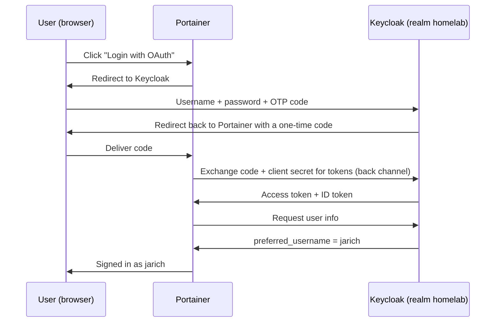

# 03 – Single sign-on: Portainer via Keycloak (OIDC)

*Date: 1 October 2026*

My first single sign-on (SSO) integration: Portainer no longer handles logins itself, but delegates authentication to Keycloak using **OpenID Connect (OIDC)**. Users sign in with their Keycloak account, including the mandatory MFA set up in [02 – Keycloak setup](02-keycloak-setup.md).

---

## How it works: the authorization code flow

Key points:
- **Portainer never sees the password or the OTP code.** Authentication happens entirely in Keycloak.
- The code that travels through the browser is **useless on its own**: it can only be exchanged for tokens together with the client secret, server to server.
- MFA is enforced centrally in Keycloak, so every application connected this way gets MFA without configuring it itself.

---

## 1. Keycloak: client `portainer`

In realm `homelab`: *Clients → Create client*.

| Setting | Value | Why |
|---|---|---|
| Client type | OpenID Connect | |
| Client ID | `portainer` | |
| Client authentication | **On** | Portainer is a server-side application that can keep a secret (confidential client) |
| Authorization | **Off** | This enables Keycloak Authorization Services (fine-grained policies enforced by Keycloak). Portainer does not use them |
| Standard flow | On | The authorization code flow |
| Direct access grants, implicit flow | Off | Not needed; implicit flow is deprecated |
| Require PKCE | Off | Portainer does not send PKCE parameters. Acceptable here because this is a confidential client using a client secret |
| Root URL / Home URL | `https://192.168.178.11:9443` | |
| Valid redirect URIs | `https://192.168.178.11:9443/` | **Exact match**, no wildcard |
| Valid post logout redirect URIs | `https://192.168.178.11:9443/` | |
| Web origins | `+` | Same origins as the redirect URIs |

**Design decision – exact redirect URI instead of a wildcard (`/*`).** Keycloak only sends authorization codes to redirect URIs on this list. An exact URI leaves no room for an attacker to have a code delivered to an unexpected path. Downside: it must match Portainer's setting character for character, including the trailing slash.

The **client secret** is taken from the *Credentials* tab and stored only in Portainer. It is not in this repository.

---

## 2. Portainer: OAuth configuration

*Settings → Authentication → OAuth → Custom provider*, with **Use SSO** and **Automatic user provisioning** enabled.

| Field | Value |
|---|---|
| Client ID | `portainer` |
| Client secret | *(from Keycloak)* |
| Authorization URL | `http://192.168.178.11:8080/realms/homelab/protocol/openid-connect/auth` |
| Access token URL | `http://192.168.178.11:8080/realms/homelab/protocol/openid-connect/token` |
| Resource URL | `http://192.168.178.11:8080/realms/homelab/protocol/openid-connect/userinfo` |
| Redirect URL | `https://192.168.178.11:9443/` |
| Logout URL | `http://192.168.178.11:8080/realms/homelab/protocol/openid-connect/logout` |
| User identifier | `preferred_username` |
| Scopes | `openid email profile` |

The local Portainer administrator account was **kept** as a break-glass account. If the SSO integration fails, it remains available via `https://192.168.178.11:9443/#!/internal-auth`.

---

## 3. Test

1. Private browser window → `https://192.168.178.11:9443` → *Login with OAuth*.
2. Redirected to the Keycloak login page of realm `homelab`.
3. Signed in as `jarich` with password and OTP code.
4. Redirected back to Portainer, signed in as `jarich`. ✅

As expected, the new user had **no access to any environment**: automatic provisioning creates the account, but authorisation is a separate, deliberate step by an administrator (*Environments → local → Manage access*).

---

## Lessons

### User identifier and scopes are generic settings
*User identifier* is the **name of the claim** in Keycloak's response that holds the username (`preferred_username`); Keycloak fills in the value per user. *Scopes* are the **categories of information** requested from Keycloak: `openid` (makes it an OIDC login), `email` and `profile`.

### Authorization ≠ authentication
The *Authorization* toggle in Keycloak sounds necessary but enables a separate feature (Authorization Services) that also forces a service account onto the client. For plain SSO it should be off.

### Keep a way back in
Keeping the local admin account meant a misconfiguration could never lock me out of Portainer. The same principle as emergency access (break-glass) accounts in Entra ID.

---

## Known limitations (lab)

- **Keycloak still runs over HTTP** (dev mode). Tokens and the client secret travel unencrypted between Portainer and Keycloak on the local network. This is resolved once Keycloak runs in production mode behind the reverse proxy with TLS.
- **No PKCE.** Acceptable for a confidential client, but PKCE is recommended for all clients nowadays.
- **Authorisation is managed in Portainer, not in Keycloak.** Portainer Community Edition cannot map Keycloak groups or roles to Portainer permissions automatically. Group-based authorisation from Keycloak will be demonstrated with Grafana.

## Next steps

- Grafana via OIDC with **role mapping** from Keycloak groups (Viewer / Admin).
- A SAML integration.
- Reverse proxy with its own CA, so Keycloak and all integrations run over HTTPS.
